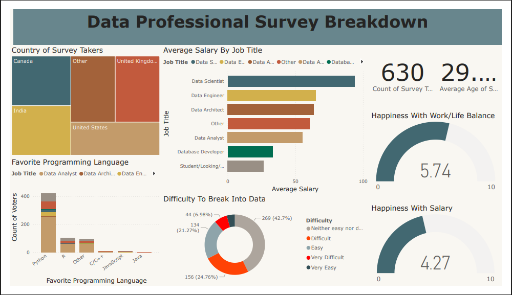

# 📊 Data Professional Survey Breakdown (Power BI Project)

This project presents a visual breakdown of survey responses from data professionals around the world. Built in Power BI, the dashboard explores key insights such as salary by job title, work-life balance satisfaction, and favorite programming languages among various roles in the data industry.

---

## 🔍 Project Overview

The dashboard provides an interactive summary of:
- 🌍 **Survey taker distribution by country**
- 💼 **Average salary by job title**
- 💬 **Favorite programming languages among roles**
- 🎯 **Perceived difficulty of entering the data field**
- 🙂 **Happiness with work/life balance and salary**

This project aims to explore trends in the data industry based on real-world feedback and help aspiring data professionals understand the landscape.

---

## 🛠 Tools & Technologies

- **Power BI Desktop** – for data transformation and interactive visualizations
- **Excel (.xlsx)** – source of the cleaned dataset
- **DAX & Power Query** – for calculated fields and data shaping

---

## 📸 Dashboard Preview

---

## 📁 Files Included

| File | Description |
|------|-------------|
| `Cleaned_Dataset.xlsx` | Preprocessed data used in the Power BI report |
| `Image_of_Dashboard.png` | Screenshot of the final interactive dashboard |
| `Data_Professional_Survey_Breakdown.pbix` | Power BI report file |
| `Data_Professional_Survey_Breakdown.pdf` | Pdf version of dashboard |
| `Original_Uncleaned_Dataset.xlsx` | Unprocessed data |

---

## 🚀 Getting Started

To explore the report yourself:

1. Open `Cleaned_Dataset.xlsx` to review the input data.
2. Download and open the `.pbix` file in Power BI Desktop.
3. Review the visualizations, filters, and slicers to explore insights.

---

## 📌 Key Takeaways

- **Python** remains the most popular language among data professionals.
- **Data Scientists** command the highest average salaries.
- Entering the data field is perceived as **challenging**, but not impossible.
- There is a **moderate satisfaction** level with salary and work-life balance.

---

## 🙋‍♂️ Author

**Ishmael Manne Dambeebu**  
Data Analyst | Bioinformatics Enthusiast  
[GitHub Profile](https://github.com/Dambee-bu)

---

## 📎 License

This project is for educational and portfolio purposes. The data used is anonymized and shared solely for showcasing analytical capabilities.

